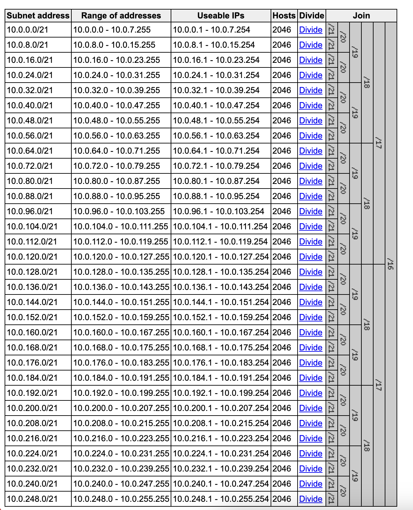

# aws-vpc module

This repo contains a [Terraform module](https://www.terraform.io/docs/modules/usage.html) to deploy an aws' vpc with options common to most applications. Additonally, the [variables.tf](variables.tf) file exposes a number of options which someone using this module can alter many default settings to match requirements of a given project.

License information can be found in [LICENSE.md](./LICENSE.md) in this same repo.

## Features
* No namespace collisions (deployable multiple times in the same account and region). [blueprint](./examples/basic/)
* Region agnostic tests in us-east-1, us-east-2, us-west-1, us-west2. [blueprint](./examples/multiRegion/)
* Three layers of subnets with distinct ability and routes for internet access. [blueprint](./examples/subnetIsolation)
* NAT Gateways and their routing scalable down to 1 for the private layer. [blueprint](./examples/scalableNatGateways)
* Configurable arbitrary number of subnet layers with default of 3. [blueprint](./examples/nonDefaultSubnetLayers)
* Ability to override CIDR block calculation for each subnet. [blueprint](./examples/cidrOverride)
* Ability to arbitrarily decide routes for IGW and NAT gateways. [blueprint](./examples/noDefaultRoutes)

Checkout the [CHANGELOG.md](./CHANGELOG.md) for this project.

## How to use this module

At a basic level, you can deploy a fully functional vpc with three subnet layers (public, private, and isolated) across three availability zones in the `10.0.0.0/16` ip block by doing the following:

```
module "vpc" {
 source = "git@github.com:FogSource/m-vpc?ref=v1.0.0"
}
```

However, that's not super interesting, let's change some of the default settings and reference a specific version of the module to use:

```
module "vpc-alpha" {
  source = "git@github.com:FogSource/m-vpc?ref=v1.0.0"
  cidr_block  = "172.5.0.0/16"

  subnet_layers = {
    public = {
      additional_tags = {}
      map_public_ip_on_launch = "true"
      routes = {
        default = {
          destination = "0.0.0.0/0"
          target      = "igw"
        }
      }
      subnets = {
        0 = {
          az_index = 0
          newbits  = 5
          netnum   = 0
        }
        1 = {
          az_index = 1
          newbits  = 5
          netnum   = 1
        }
        2 = {
          az_index = 2
          newbits  = 5
          netnum   = 2
        }
      }
    }
    private = {
      additional_tags = {}
      map_public_ip_on_launch = "false"
      routes = {
        default = {
          destination = "0.0.0.0/0"
          target      = "nat"
        }
      }
      subnets = {
        0 = {
          az_index = 0
          newbits  = 5
          netnum   = 9
        }
        1 = {
          az_index = 1
          newbits  = 5
          netnum   = 10
        }
        2 = {
          az_index = 2
          newbits  = 5
          netnum   = 11
        }
        3 = {
          az_index = 0
          newbits  = 5
          netnum   = 12
        }
        4 = {
          az_index = 1
          newbits  = 5
          netnum   = 13
        }
        5 = {
          az_index = 2
          newbits  = 5
          netnum   = 14
        }
        6 = {
          az_index = 0
          newbits  = 5
          netnum   = 15
        }
        7 = {
          az_index = 1
          newbits  = 5
          netnum   = 16
        }
        8 = {
          az_index = 2
          newbits  = 5
          netnum   = 17
        }
      }
    }
  }

  tag_map = {
    Name        = "SuperAppVpc"
    Environment = "Production"
  }

}
```

In the above version we changed some tags, the CIDR block, and we increased the number of subnets in the private layer to nine while removing all isolated ones.

This module has many variables that can be changed and there will be many more in the future. See the variables.tf file linked above for all parts currently exposed by this module.

### A note on networking.

By default this module will generate 9 subnets split among 3 networking layers spread across up to 3 availability zones. It is set up to handle changes to this networking model, allowing the user to specify an arbitrary number of subnets in each layer without having to mess with renumbering the subnetting of each layer (Note this does require that the user understands the relationship between the VPC CIDR and the `newbits` being provided each subnet definition, and that the provided subnets fit within the `netnum`). In conjunction with that subnet sizing, the layers are assigned as follows:

`Public 10.0.x.x/21`

|      az-a |      az-b |      az-c |
|----------:|----------:|----------:|
|       0.0 |       8.0 |      16.0 |
|      24.0 |      32.0 |      40.0 |
|      48.0 |      56.0 |      64.0 |

`Private 10.0.x.x/21`

|      az-a |      az-b |      az-c |
|----------:|----------:|----------:|
|      72.0 |      80.0 |      88.0 |
|      96.0 |     104.0 |     112.0 |
|     120.0 |     128.0 |     136.0 |

`Isolated 10.0.x.x/21`

|      az-a |      az-b |      az-c |
|----------:|----------:|----------:|
|     144.0 |     152.0 |     160.0 |
|     168.0 |     176.0 |     184.0 |
|     192.0 |     200.0 |     208.0 |


### How to understand subnetting
[Visual Subnet Calculator](https://www.davidc.net/sites/default/subnets/subnets.html) is a great tool to understand how the subnet configuration works.  Given the module's default VPC CIDR of `10.0.0.0/16` and the default `newbits` setting of `5` for each subnet, the following subdivision of the VPC CIDR is relevant to the default settings:


You will notice that 5 `newbits` of a `/16` produces 32 `/21` subnet network CIDR ranges (or 2**5). They are `/21` ranges because 5 `newbits` of a `/16` is `/21` (or 16+5). The `netnum` used in each subnet configuration is simply the index number for 1 of the 32 available subnet network CIDR ranges.  For example the first private subnet uses `netum=9` which would be the 10th subnet network CIDR range in the list above (index values start at 0), or the CIDR range `10.0.72.0/21`.


### Configuring the subnet layers
The variable `subnet_layers` is a map of all subnet layers with the keys being the name of the subnet layer (i.e. `public`, `private`, `isolated`) and the value being a map of that subnet layer's configuration.  Each subnet layer configuration must provide the keys `additional_tags`, `map_public_ip_on_launch`, `routes`, and `subnets`.  An example of the `private` subnet layer configuration from the defaults is provided below, along with an explanation for each of the keys and values:
```
additional_tags = {}
map_public_ip_on_launch = "false"
routes = {
  default = {
    destination = "0.0.0.0/0"
    target      = "nat"
  }
}
subnets = {
  0 = {
    az_index = 0
    newbits  = 5
    netnum   = 9
  }
  1 = {
    az_index = 1
    newbits  = 5
    netnum   = 10
  }
  2 = {
    az_index = 2
    newbits  = 5
    netnum   = 11
  }
}
```
* **additional_tags** - The value is a map of key value pairs that represent additional tags to be added to the created subnets and routes.  The provided value can be an empty map `{}`.
* **map_public_ip_on_launch** - The value is a boolean true or false and represents the subnet setting for mapping a public IP to any new instances launched in the subnet.
* **routes** - The value is a map of routes to be added to each subnet created in the subnet layer.  Each route must have a unique key, and its value is a map with the keys `destination` and `target`.  Provide a value of empty map `{}` to have m-vpc create no routes for any of the subnets in this subnet layer.
 * **destintation** - The CIDR block for the destination traffic for the route.
 * **target** - The type of target for the route.  Value values here include `nat` and `igw`.
* **subnets** - The value is a map of subnets to be added.  Each subnet must have a unique key, and its value is a map with the keys `az_index`, `newbits`, `netnum`, and `cidr_block`. Each key in `subnets` represents a single subnet created for the subnet layer, to create 3 subnets add 3 unique keys to this map.  There should be at least 1 unique subnet created for each subnet layer.
  * **az_index** - An index value of the Availability Zones available in the region to place the subnet into. Note if this index value is larger than number of AZs, it will first have modulo applied to it with the length of the AZs available in the region.  This key is required.
  * **newbits** - The number of new bits to add to the VPC CIDR in assigning a CIDR range to the subnet. This key is used in conjuction with `netnum`, and either both `newbits` and `netnum` are required, or `cidr_block` is required.
  * **netnum** - The subnet network range index value of the VPC CIDR subnets using `newbits` to assign a CIDR range to the subnet. This key is used in conjuction with `newbits`, and either both `newbits` and `netnum` are required, or `cidr_block` is required.
  * **cidr_block** - Provided to override the module calculation of CIDR range for the subnet.  This value must be a valid subnet range of the VPC CIDR, and will supercede use of `newbits` and `netnum` for subnet configuration.

## Contributing

This repo utilizes a test framework for ensuring features and bug fixes continue to work. This section will go over how to set up your development environment for contributing to this repository.

After being assigned a Github Issue from the [issues page](https://github.com/fogsource/tf-aws-vpc/issues), clone the repository locally and create a new branch utilizing the `-b` flag like such:

```bash
~ git clone git@github.com:fogsource/tf-aws-vpc
Cloning into 'tf-aws-vpc'...
remote: Enumerating objects: 252, done.
remote: Counting objects: 100% (252/252), done.
remote: Compressing objects: 100% (154/154), done.
remote: Total 252 (delta 75), reused 244 (delta 68), pack-reused 0
Receiving objects: 100% (252/252), 405.47 KiB | 2.25 MiB/s, done.
Resolving deltas: 100% (75/75), done.
➜  ~ cd tf-aws-vpc
➜  tf-aws-vpc git:(master) git checkout -b dhelmick/bug-iam-problem
Switched to a new branch 'dhelmick/bug-iam-problem'
➜  tf-aws-vpc git:(dhelmick/bug-iam-problem)
```

Thereafter, make your changes to the Terraform code as required.

If you are adding new functionality, depending on the size of the feature, consider adding it to the [Features](## Features) section of the README. In general, large new features should be listed.

All changes (small features, big features, bug fixes, etc) should have a test added to them. Tests are composed of two sets of files: example terraform and golang test files.

### Examples
The [examples](./examples) directory contains deployable Terraform that will set up infrastructure such that a test can be run against it. A common tests is the ability to deploy the [same infrastrcuture twice](./examples/basic) in the same account and region demonstrating that namespace collisions don't exist. Another common test is deploying to every [US AWS Region](./examples/multiRegion) (us-east-1, us-east-2, us-west-1, us-west-2) to demonstrate region agnosticism.

More intricate tests for this repo include things like created isolated layers of [subnets](./examples/subnetIsolation), which brings us to the second party of the test framework.... go-tests.

### Go-Tests
We utilize the Go language's [test framework](https://pkg.go.dev/testing) and a series of other libraries to reach over to the `examples/` folder, run terraform commands against the infrastructure there, and then do any sort of outside verification of functionality in that test.

### Setting up the testing development environment
Some things to install are:
* [go](https://go.dev/doc/install) -- note: `brew install go` is pretty good for macos people
* [terratest](https://terratest.gruntwork.io/docs/getting-started/quick-start/) library.
* [aws sdk for go](https://aws.github.io/aws-sdk-go-v2/docs/getting-started/)

### Adding to CHANGELOG
Finally, the last part of the edits to make are to update [CHANGELOG](./CHANGELOG.md). FogSource modules utilize [semantic versioning](https://semver.org/) and updates to the CHANGELOG should reflect that.

### Making a PR
Once your are ready to get your changes, submit a [pull request](https://github.com/fogsource/tf-aws-vpc/compare) to the default/master/main branch. That will kick off a series of tests in Github Actions to validate it meets a series of basic tests, as well as validating the previous tests continue to work.

## CODEOWNERS
This FogSource repository is maintained by a team of (hopefully) two listed in the [CODEOWNERS](./CODEOWNERS) file; one responsible for the repository and the other for the tests. Pull-requests back to the master branch will target these folks for PR-review using github automatic sauce.

## Requirements

| Name | Version |
|------|---------|
| <a name="requirement_terraform"></a> [terraform](#requirement\_terraform) | >= v0.12.0 |
| <a name="requirement_aws"></a> [aws](#requirement\_aws) | >= 4.0 |

## Providers

| Name | Version |
|------|---------|
| <a name="provider_aws"></a> [aws](#provider\_aws) | >= 4.0 |

## Modules

| Name | Source | Version |
|------|--------|---------|
| <a name="module_routes"></a> [routes](#module\_routes) | ./modules/routes | n/a |

## Resources

| Name | Type |
|------|------|
| [aws_default_security_group.default](https://registry.terraform.io/providers/hashicorp/aws/latest/docs/resources/default_security_group) | resource |
| [aws_eip.nat](https://registry.terraform.io/providers/hashicorp/aws/latest/docs/resources/eip) | resource |
| [aws_flow_log.main](https://registry.terraform.io/providers/hashicorp/aws/latest/docs/resources/flow_log) | resource |
| [aws_internet_gateway.main](https://registry.terraform.io/providers/hashicorp/aws/latest/docs/resources/internet_gateway) | resource |
| [aws_nat_gateway.main](https://registry.terraform.io/providers/hashicorp/aws/latest/docs/resources/nat_gateway) | resource |
| [aws_route_table.igw](https://registry.terraform.io/providers/hashicorp/aws/latest/docs/resources/route_table) | resource |
| [aws_route_table.main](https://registry.terraform.io/providers/hashicorp/aws/latest/docs/resources/route_table) | resource |
| [aws_route_table_association.igw](https://registry.terraform.io/providers/hashicorp/aws/latest/docs/resources/route_table_association) | resource |
| [aws_route_table_association.main](https://registry.terraform.io/providers/hashicorp/aws/latest/docs/resources/route_table_association) | resource |
| [aws_s3_bucket.flow_logs](https://registry.terraform.io/providers/hashicorp/aws/latest/docs/resources/s3_bucket) | resource |
| [aws_s3_bucket_acl.flow_logs](https://registry.terraform.io/providers/hashicorp/aws/latest/docs/resources/s3_bucket_acl) | resource |
| [aws_subnet.main](https://registry.terraform.io/providers/hashicorp/aws/latest/docs/resources/subnet) | resource |
| [aws_vpc.main](https://registry.terraform.io/providers/hashicorp/aws/latest/docs/resources/vpc) | resource |
| [aws_availability_zones.main](https://registry.terraform.io/providers/hashicorp/aws/latest/docs/data-sources/availability_zones) | data source |
| [aws_s3_bucket.flow_logs](https://registry.terraform.io/providers/hashicorp/aws/latest/docs/data-sources/s3_bucket) | data source |

## Inputs

| Name | Description | Type | Default | Required |
|------|-------------|------|---------|:--------:|
| <a name="input_az_width"></a> [az\_width](#input\_az\_width) | Controls how many AvailabilityZones this VPC should try to span per subnet layer. Note, if var.az\_width is greater than the actual AZs available in a given region then the index is wrapped around by taking the index modulo of the length of the actual AZ list | `string` | `"3"` | no |
| <a name="input_cidr_block"></a> [cidr\_block](#input\_cidr\_block) | The CIDR block this VPC will cover. | `string` | `"10.0.0.0/16"` | no |
| <a name="input_enable_flow_logs"></a> [enable\_flow\_logs](#input\_enable\_flow\_logs) | A bool determining whether to enable flow-logs for this vpc to an S3 bucket. | `bool` | `false` | no |
| <a name="input_flow_log_bucket"></a> [flow\_log\_bucket](#input\_flow\_log\_bucket) | The ARN of the bucket to which flow-logs will be directed. Note: if var.enable\_flow\_logs is true and this is variable is not changed, a bucket will be created. | `string` | `""` | no |
| <a name="input_instance_tenancy"></a> [instance\_tenancy](#input\_instance\_tenancy) | Controls whether instances in this VPC launch with dedicated tenancy or not. By default they do not. | `string` | `"default"` | no |
| <a name="input_nat_gateway_subnet_layer"></a> [nat\_gateway\_subnet\_layer](#input\_nat\_gateway\_subnet\_layer) | The subnet layer to locate the nat gateway instances in.  The value provided here must exist as a key in the subnet\_layers input. | `string` | `"public"` | no |
| <a name="input_nat_instances"></a> [nat\_instances](#input\_nat\_instances) | The number of NAT gateways to install. Note, this number must greater than or equal to var.subnet\_map.private. | `string` | `"3"` | no |
| <a name="input_subnet_layers"></a> [subnet\_layers](#input\_subnet\_layers) | A map of subnet-layers as keys, and subnets configuration per layer as values.  Each value specifies number of subnets, which AZs they are placed in, and other subnet attributes. | `map` | <pre>{<br>  "isolated": {<br>    "additional_tags": {},<br>    "map_public_ip_on_launch": "false",<br>    "routes": {},<br>    "subnets": {<br>      "0": {<br>        "az_index": 0,<br>        "netnum": 18,<br>        "newbits": 5<br>      },<br>      "1": {<br>        "az_index": 1,<br>        "netnum": 19,<br>        "newbits": 5<br>      },<br>      "2": {<br>        "az_index": 2,<br>        "netnum": 20,<br>        "newbits": 5<br>      }<br>    }<br>  },<br>  "private": {<br>    "additional_tags": {},<br>    "map_public_ip_on_launch": "false",<br>    "routes": {<br>      "default": {<br>        "destination": "0.0.0.0/0",<br>        "target": "nat"<br>      }<br>    },<br>    "subnets": {<br>      "0": {<br>        "az_index": 0,<br>        "netnum": 9,<br>        "newbits": 5<br>      },<br>      "1": {<br>        "az_index": 1,<br>        "netnum": 10,<br>        "newbits": 5<br>      },<br>      "2": {<br>        "az_index": 2,<br>        "netnum": 11,<br>        "newbits": 5<br>      }<br>    }<br>  },<br>  "public": {<br>    "additional_tags": {},<br>    "map_public_ip_on_launch": "true",<br>    "routes": {<br>      "default": {<br>        "destination": "0.0.0.0/0",<br>        "target": "igw"<br>      }<br>    },<br>    "subnets": {<br>      "0": {<br>        "az_index": 0,<br>        "netnum": 0,<br>        "newbits": 5<br>      },<br>      "1": {<br>        "az_index": 1,<br>        "netnum": 1,<br>        "newbits": 5<br>      },<br>      "2": {<br>        "az_index": 2,<br>        "netnum": 2,<br>        "newbits": 5<br>      }<br>    }<br>  }<br>}</pre> | no |
| <a name="input_tag_map"></a> [tag\_map](#input\_tag\_map) | A default tag map to be placed on all possible resources created by this module. | `map` | <pre>{<br>  "Application": "PoetryGenerator",<br>  "CostCenter": "Networking",<br>  "Customer": "VogonCorp",<br>  "Environment": "Demo",<br>  "Name": "FogSource"<br>}</pre> | no |

## Outputs

| Name | Description |
|------|-------------|
| <a name="output_default_security_group"></a> [default\_security\_group](#output\_default\_security\_group) | The ID of the default Security Group created by this module |
| <a name="output_eip_nat_gateway"></a> [eip\_nat\_gateway](#output\_eip\_nat\_gateway) | The elastic IP addresses created by this module for use on nat-gateways |
| <a name="output_flow_log"></a> [flow\_log](#output\_flow\_log) | The flow-log object created by this module when enabled |
| <a name="output_internet_gateway"></a> [internet\_gateway](#output\_internet\_gateway) | The internet gateway created by this module |
| <a name="output_internet_gateway_route_table"></a> [internet\_gateway\_route\_table](#output\_internet\_gateway\_route\_table) | The route table for the internet gateway ingress routes |
| <a name="output_nat_gateway"></a> [nat\_gateway](#output\_nat\_gateway) | The nat-gateways created by this module |
| <a name="output_route_table_associations"></a> [route\_table\_associations](#output\_route\_table\_associations) | The route-table-assocations linking up subnets to their respective tables |
| <a name="output_route_tables"></a> [route\_tables](#output\_route\_tables) | The route tables created by this module |
| <a name="output_s3_bucket_flow_logs"></a> [s3\_bucket\_flow\_logs](#output\_s3\_bucket\_flow\_logs) | The s3 bucket created by this module when flow-logs are enabled and a bucket-arn is not otherwise provided |
| <a name="output_subnets"></a> [subnets](#output\_subnets) | The subnets created by this module |
| <a name="output_vpc"></a> [vpc](#output\_vpc) | The VPC created by this module |
